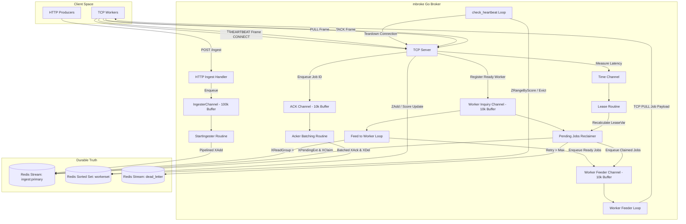

# mbroke

[](https://github.com/mbroke/mbroke)
[](https://opensource.org/licenses/MIT)
[](https://pkg.go.dev/github.com/mbroke/mbroke)

`mbroke` is a distributed, high-throughput message broker written in Go. It uses Redis Streams as a durable, persistent source of truth storage, while the broker manages active worker dispatch, leasing, worker heartbeats, retries, and dead-letter recovery.

By offloading queue persistence to Redis Streams and managing scheduling, worker lifecycles, and failure recovery inside a stateful Go broker, `mbroke` bridges the gap between raw persistence and reliable distributed orchestration.

Workers communicate with the broker via a custom, lightweight binary protocol over stateful TCP sockets, achieving low-latency job delivery and rapid fault detection.

---

## Motivation

Redis Streams provide an excellent foundation for append-only log data structures, but building a production-grade distributed work queue directly on top of them presents significant challenges:

1. **Active Polling Overhead**: Running multiple workers that poll Redis Streams via `XREADGROUP` or `XPENDING` causes significant CPU and network load on the Redis cluster.
2. **Coarse Connection Lifecycle Tracking**: Redis has no concept of application-level worker health. If a worker process silently crashes or hangs (zombie state), its lease remains active until manually reclaimed, delaying job reprocessing.
3. **Static Visibility Leases**: Traditional message queues use static visibility timeouts. If set too short, jobs are processed twice; if set too long, failed jobs sit idle for minutes before being retried.
4. **Network and Command Overhead**: Issuing an `XADD` for every single job ingestion and an `XACK`/`XDEL` for every single completion introduces massive TCP roundtrip overhead.

`mbroke` solves these problems by placing a stateful, in-memory broker in front of Redis:
* **Ingestion and ACK pipelining** buffers write operations to minimize Redis command counts.
* **Stateful TCP connections** with low-overhead binary framing enable the broker to actively push jobs to workers and monitor their lifecycles.
* **Active client heartbeat tracking** via a Redis sorted set allows the broker to detect crashed or disconnected workers in under 10 seconds.
* **Dynamic, adaptive lease estimation** calculates the rolling average processing time to dynamically shrink failover times for fast tasks and expand them for slow ones.

---

## High-Level Architecture



---

## Internal Workflows

### 1. Ingestion: Producer → Broker → Redis Stream
Producers submit JSON payloads to the broker's HTTP server (`POST /ingest`).
1. The ingest handler parses the payload and enqueues it to `IngesterChannel` (buffered up to 100,000 jobs).
2. The `StartIngester` goroutine drains this channel.
3. To eliminate network overhead, it accumulates jobs and flushes them to Redis via a pipeline (`XAdd`) in batches of **1,000 jobs** or every **5 milliseconds**.

### 2. In-Memory Broker Scheduler
Jobs are scheduled reactively to prevent polling loops:
1. When a worker is idle, it sends a TCP `PULL` frame to the broker.
2. The broker registers the worker's availability by placing its UUID in the `Worker_inquiry_channel`.
3. Two scheduling loops watch this channel:
   * **`Feed_to_worker`**: Reads new (`>`) jobs from the primary Redis Stream via `XReadGroup` and passes them to the worker feeder.
   * **`Pending_jobs`**: Scans the stream's pending list entries (`XPendingExt`) for expired leases, claims them via `XClaim`, and redirects them for reprocessing.
4. The **`Worker_feeder`** retrieves the message from the queue, records its dispatch timestamp, and pushes the payload directly down the worker's TCP socket.

### 3. Adaptive Lease Management
Traditional visibility timeouts are static. `mbroke` implements a dynamic feedback loop:
1. When a worker completes a job, it sends a `TACK` frame containing the job ID.
2. The broker calculates the processing duration: `duration = time.Since(SentTime[jobID])` and forwards it to the `Time_channel`.
3. The `Lease_routine` reads processing times and computes a rolling average:
   $$\text{avg} = \frac{9 \times \text{avg} + \text{duration}}{10}$$
4. Every second, the visibility timeout is updated dynamically:
   $$\text{LeaseVar} = \max(\min(2 \times \text{avg} \times \text{BatchSize}, \text{MaxLease}), \text{MinLease})$$
   * *`MinLease` = 1 second*
   * *`MaxLease` = 30 seconds*
5. This dynamic lease duration is passed directly to the `Pending_jobs` reclaimer for accurate, adaptive recovery times.

### 4. Batched ACK Processing
Just as job ingestion is batched, acknowledgements are aggregated to prevent Redis write congestion:
1. When a task is acknowledged (`TACK`), its job ID is sent to the `ACK_channel`.
2. The `Acker` routine collects these IDs and issues a batched Redis command pipeline every **2,000 milliseconds**.
3. It performs an `XAck` to acknowledge the consumer group, followed by `XDel` to remove the payload from the stream. Deleting processed messages keeps Redis memory consumption strictly bounded.

### 5. Dead-Letter Recovery (DLQ)
If a task repeatedly fails or causes worker crashes:
1. The `Pending_jobs` loop inspects the delivery count of pending jobs fetched via `XPendingExt`.
2. If a job's retry count exceeds the configured `RETRY_COUNT` (default: 3):
   * It is read from the stream via `XRange`.
   * It is written to the dead-letter stream specified by `DEAD_LETTER_NAME` (default: `dead_letter`).
   * It is removed from the primary stream via `XAck` and `XDel`.

### 6. Worker Discovery and Heartbeats
Active worker tracking prevents scheduling jobs to disconnected or frozen workers:
1. Upon connecting, the worker issues a `CONNECT` frame containing the shared `SECRET`.
2. Upon authentication, the broker registers the worker with a unique UUID and adds it to a Redis sorted set (`workerset`) with a score set to `time.Now().Unix() + 10`.
3. The worker sends periodic `HEARTBEAT` frames (every 100ms in benchmarks) containing its next expected score. The broker updates the sorted set with this value.
4. A background loop (`check_heartbeat`) scans the sorted set every **2 seconds** using `ZRangeByScore` to identify workers that have missed their heartbeat window.
5. If a worker is deemed dead, its connection is closed, it is removed from the active client map and the sorted set, and its leased jobs are left to be reclaimed by `Pending_jobs`.

---

## TCP Worker Protocol Reference

Workers communicate with the broker over a custom, lightweight binary protocol designed for speed and low CPU overhead. 

### Message Frame Format

All TCP messages are framed with a 5-byte header followed by a variable-length payload:

```
+-----------------------------------+---------------+-----------------------+
|  Length (4 Bytes / Big-Endian)    | MsgType (1 B) | Payload (N Bytes)     |
+-----------------------------------+---------------+-----------------------+
```
* **Length** (`uint32`): The total length of the remaining frame (`1 + len(Payload)`).
* **MsgType** (`uint8`): Code representing the command type.
* **Payload**: Raw byte sequence matching the message type format.

### Message Types

| Value | Type | Direction | Payload Description |
| :---: | :--- | :--- | :--- |
| `0` | **`CONNECT`** | Worker $\rightarrow$ Broker | The authentication shared secret string (e.g., `secret`). |
| `1` | **`HEARTBEAT`** | Worker $\leftrightarrow$ Broker | String representation of the client's current Unix timestamp + 10s. Broker replies with `0` if worker is unknown/rejected. |
| `2` | **`TACK`** | Worker $\leftrightarrow$ Broker | Client sends the Job ID string to acknowledge completion, or `"dack"` to NACK. Broker replies with `1` on success, `0` on rejection. |
| `3` | **`PULL`** | Worker $\leftrightarrow$ Broker | Client sends empty payload to request jobs. Broker responds with a `PULL` frame containing a JSON array of `[]types.JobInfo`. |
| `4` | **`INVALID`** | Broker $\rightarrow$ Worker | Sent by the broker when an invalid message type is received. Returns `0`. |

---

## Configuration Reference

The broker reads configuration parameters from environment variables (or a local `.env` file).

### Broker & Queue Configuration

| Variable | Type | Default | Description |
| :--- | :---: | :--- | :--- |
| `PORT` | `int` | `8080` | Port for HTTP ingestion and administration endpoint. |
| `TCP_SERVER_PORT` | `int` | `9000` | Port for the stateful TCP worker server. |
| `STREAM_NAME` | `string` | `ingest:primary` | Redis Stream name used for durable job storage. |
| `CONSUMER_GROUP_NAME`| `string` | `primary` | Redis Stream Consumer Group name. |
| `DEAD_LETTER_NAME` | `string` | `dead_letter` | Redis Stream name for dead-lettered jobs. |
| `BATCH_SIZE` | `int64` | `100` | Max number of jobs dispatched per worker poll. |
| `RETRY_COUNT` | `int64` | `3` | Maximum processing attempts before dead-lettering. |
| `SECRET` | `string` | `secret` | Shared authentication secret required for workers. |
| `SET_NAME` | `string` | `workerset` | Key name for the Redis sorted set tracking worker heartbeats. |
| `MAX_LEN` | `int64` | `2000000` | Maximum length buffer (not utilized in active pipeline). |

### Redis Configuration

| Variable | Type | Default | Description |
| :--- | :---: | :--- | :--- |
| `REDIS_ADDR` | `string` | `redis:6379` | Redis server address. |
| `REDIS_POOL_SIZE` | `int` | `10` | Redis client connection pool size. |
| `REDIS_PASSWORD` | `string` | *Empty* | Redis password. |
| `REDIS_DB` | `int` | `0` | Redis Database index. |
| `REDIS_PROTOCOL` | `int` | `2` | Redis connection protocol (`2` or `3`). |

---

## Runtime Statistics & Performance Observations

The statistics logs represent the real-time operational state of the broker under load. Below are critical observations analyzed from runtime benchmarks:

### 1. High-Throughput Ingestion (Producers Active, Workers Offline)

During the pure ingestion phase, producers write to the `/ingest` HTTP endpoint while no workers are connected (`workers = 0`).

```
[stats] in/s: 52152  (peak: 58296 ) | out/s: 0  (peak: 0 ) | stream: 345495 | workers: 0 | pending: 0
[stats] in/s: 54788  (peak: 58296 ) | out/s: 0  (peak: 0 ) | stream: 372313 | workers: 0 | pending: 0
```

* **Observation**: Ingestion throughput consistently runs between **50k and 58k jobs/sec**.
* **Analysis**: This demonstrates the efficiency of the broker's in-memory buffering channel coupled with Redis pipeline writes, which bypasses the latency of single-item network hops.

### 2. High-Concurrency Dispatch & Leasing

When consumers are introduced to the cluster, the broker schedules jobs concurrently.

```
[stats] in/s: 0  (peak: 58296 ) | out/s: 35584  (peak: 35584 ) | stream: 1310593 | workers: 250 | pending: 5793
[stats] in/s: 0  (peak: 58296 ) | out/s: 0      (peak: 35584 ) | stream: 1310593 | workers: 250 | pending: 11297
```

* **Observation**: With **250 active workers**, dispatch peaks at roughly **35.5k jobs/sec**. The `pending` lease length fluctuates rapidly.
* **Analysis**: As jobs are distributed, they enter the pending list. The rapid swing in the pending queue demonstrates concurrent task execution and high-frequency binary acknowledgements.

### 3. Queue Draining Phase

This phase showcases workers consuming the remaining queue backlog after producers stop sending jobs.

```
[stats] in/s: 0  (peak: 58296 ) | out/s: 0     (peak: 37320 ) | stream: 16178 | workers: 250 | pending: 13458
[stats] in/s: 0  (peak: 58296 ) | out/s: 34992 (peak: 37320 ) | stream: 7430  | workers: 250 | pending: 7430
[stats] in/s: 0  (peak: 58296 ) | out/s: 0     (peak: 37320 ) | stream: 861   | workers: 250 | pending: 861
[stats] in/s: 0  (peak: 58296 ) | out/s: 3444  (peak: 37320 ) | stream: 0     | workers: 250 | pending: 0
```

* **Observation**: Jobs are dispatched in bursts (`out/s` spikes to ~35k, then drops to 0, while `pending` jobs step down in blocks).
* **Analysis**: The broker processes worker inquiries in batch iterations. Pending leases decrease rapidly as workers resolve tasks, showing that the system successfully empties the stream to `0` without leaking stale leases.

---

## Installation & Usage

### Prerequisites
* Go 1.22 or higher
* Redis 6.2 or higher (Redis 7.0+ recommended)

### Clone the Repository
```bash
git clone https://github.com/mbroke/mbroke.git
cd mbroke
```

### Running the Broker

1. **Configure Environment**: Create a `.env` file in the root directory:
   ```env
   PORT=8080
   TCP_SERVER_PORT=9000
   STREAM_NAME=ingest:primary
   DEAD_LETTER_NAME=dead_letter
   SECRET=your_auth_secret
   REDIS_ADDR=127.0.0.1:6379
   BATCH_SIZE=100
   RETRY_COUNT=3
   ```
2. **Start the Broker**:
   ```bash
   go run main.go
   ```

### Running the Benchmarks

The repository provides benchmarking tools to validate throughput and chaos resilience.

#### 1. Running the Worker Client
The benchmark worker simulates production conditions, complete with random network drops, processing delays, zombie states, and garbage data injection.
```bash
cd _bench/consumer
# Ensure .env is configured with correct SECRET and BROKER_URL
go run main.go
```

#### 2. Running the Job Producer
The producer injects synthetic workloads at maximum throughput and runs the monitoring thread.
```bash
cd _bench/producer
go run producer.go
```

---

## Project Structure

```
.
├── main.go               # Broker entry point; initializes server and background loops
├── routes
│   └── ingest.go         # HTTP POST /ingest handler
├── types
│   └── types.go          # Shared Structs (Job, Worker, Messages, Protocol Frames)
├── utils
│   ├── config.go         # Environment configuration parser & defaults
│   ├── lease.go          # Adaptive lease calculations and background routine
│   ├── redis.go          # Redis client wrapper & global communication channels
│   ├── redis_fucntions.go# Redis Stream interactions, Ingestion, Reclaimer, DLQ, ZSet
│   └── worker_handler.go # TCP Server, protocol frame encoder/decoder, heartbeats
├── _bench                # Ingestion and Worker benchmarks for throughput testing
│   ├── consumer          # Simulated TCP worker suite with chaos generation
│   └── producer          # HTTP ingestion load tester & stats monitoring
└── Dockerfile            # Container definition for the broker
```

---

## Design Decisions & Rationale

* **Raw TCP Sockets for Workers**: Using HTTP or gRPC introduces standard header structures and connection framing overhead. A raw TCP socket with a custom 5-byte header allows parsing at wire-speed with near-zero allocation overhead.
* **In-Memory Go Channels for Buffering**: The broker acts as an asynchronous buffer. Discarding synchronous database writes in favor of a buffered Go channel (`IngesterChannel`) allows HTTP producers to get instant `201 Created` responses, deferring Redis writing to optimized batch workers.
* **Redis Sorted Set for Worker Heartbeats**: Storing worker scores (`Timestamp + 10s`) inside a sorted set allows the broker to perform dead-worker scans using a single $O(\log N + M)$ range command (`ZRangeByScore`), avoiding costly iterations over large active client maps.
* **Lease-Deletion Model for GC**: Instead of keeping processed jobs in the stream history, `mbroke` issues an `XDel` immediately after `XAck`. This turns the Redis Stream into a strict FIFO ring-buffer, preventing infinite memory leaks and keeping Redis RAM footprint constant.

---

## Future Roadmap

- [ ] **TLS Support for Workers**: Encrypt TCP socket communications using TLS configuration.
- [ ] **Token-Based Authentication**: Replace the static shared secret with dynamic JWT or token-based authorization.
- [ ] **Worker Partition Assignment**: Support assigning worker threads to specific partition keys within the stream for ordered execution.
- [ ] **Web UI Dashboard**: Build a lightweight operational dashboard to view active leases, DLQ length, worker distribution, and latency statistics.
- [ ] **Clustered Broker Orchestration**: Support clustering multiple `mbroke` broker instances with shared state synchronization for higher availability.
